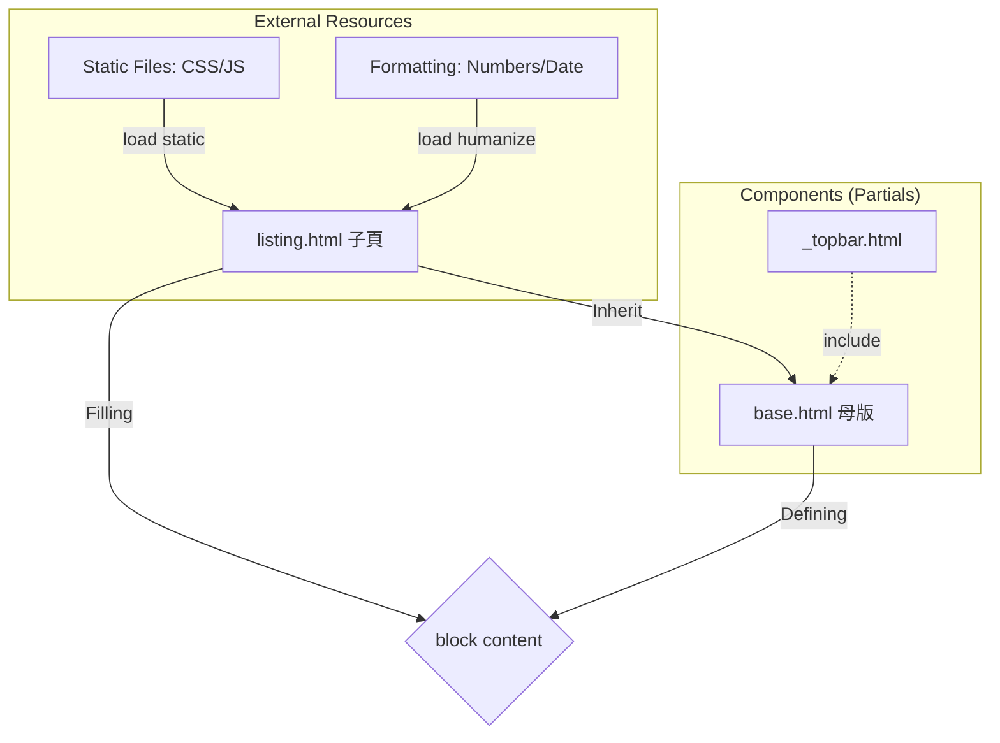
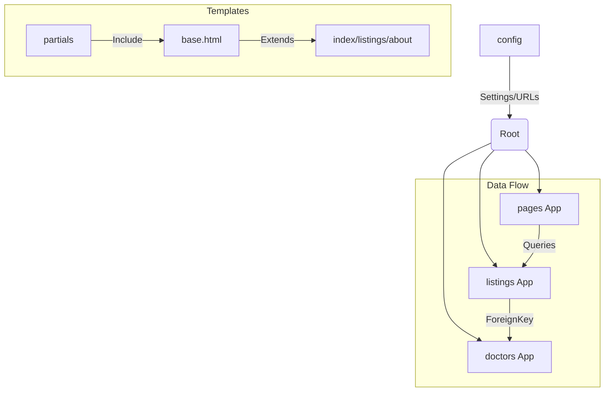
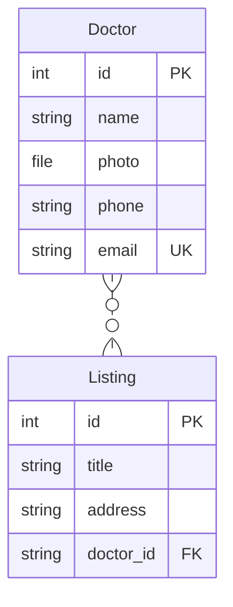

models 定義資料、views 處理邏輯、templates 渲染畫面

ORM：all()、filter() and get_object_or_404

 和  to make dynamic image and pages

（邏輯）和 {{ variable }}（變數）



|標籤 |角色 |一句話功能說明|
| 組件導入 |將獨立的小檔案（如 Topbar）直接嵌入目前位置，達到代碼重複使用。
| 繼承母版 |宣告此頁面是某個母版的「分身」，必須放在檔案的最頂部。
 |挖窿/填窿 |在母版中預留空間（挖窿），或在子網頁中填入內容（填窿）。
 |資源連接 |授權頁面使用  標籤來讀取圖片、CSS 或 JavaScript 檔案。
 |格式化工具 |啟用 Django 內建工具，將生硬的數字或日期轉化為「人類友好」格式（如加逗號）。

---


| 標籤                | 角色       | 一句話功能說明                                                               |
| ------------------- | ---------- | ---------------------------------------------------------------------------- |
|    | 組件導入   | 將獨立的小檔案（如 Topbar）直接嵌入目前位置，達到代碼重複使用。              |
|    | 繼承母版   | 宣告此頁面是某個母版的「分身」，必須放在檔案的最頂部。                       |
|      | 挖窿/填窿  | 在母版中預留空間（挖窿），或在子網頁中填入內容（填窿）。                     |
|    | 資源連接   | 授權頁面使用  標籤來讀取圖片、CSS 或 JavaScript 檔案。           |
|  | 格式化工具 | 啟用 Django 內建工具，將生硬的數字或日期轉化為「人類友好」格式（如加逗號）。 |

---

---

1. 專案架構概覽 (Mermaid Diagram)
   你的專案採用了標準的 Django MVT 架構，並透過 config 資料夾進行全局管理。



2.

- 核心技術亮點
  🔧 後端配置 (Config & Settings)
  - 環境安全性：使用 .env 隱藏 SECRET_KEY 和 DATABASE_URL，避免敏感資訊流出。
  - 靜態與媒體檔案：
  - STATICFILES_DIRS 專門存放 UI 的 CSS/JS。
  - MEDIA_ROOT 存放用戶上傳的圖片（如診所照片、醫生頭像）。
  - 重要修正紀錄：在 config/urls.py 結尾必須加上 + static(settings.MEDIA_URL, ...) 否則圖片會報 404 錯誤。
- 🏥 診所管理 (Listings App)
  - 模型設計 (Model)：
    - 使用了 photo_main 及多個可選圖片欄位 (photo_1 ~ photo_4)。
    - Meta 類別中定義了 ordering = ['-list_date']，確保新診所自動排在最前面。
  - Admin 自定義：
    - list_editable：讓你不用進入編輯頁面就能直接切換「是否發佈」和「房間數量」。
    - search_fields：支援標題、行政區和醫生姓名搜索。
- 📄 分頁與動態渲染 (Views & Templates)
  - 分頁器 (Paginator)：
    - 在 views.py 限制每頁顯示 3 筆資料。
    - 在 listings.html 配合 has_other_pages 邏輯，實現了包含「上一頁、下一頁、數字跳頁」的高級導航欄。
  - 模板標籤技巧：
    - humanize：用於將費用數字加逗號 (intcomma)。
    - timesince：顯示資料發佈了多久（如：2 days ago）。

3. 實戰問題解決紀錄 (Debug History)
   |問題|現象|解決方案|
   |-|-|-|
   TemplateSyntaxError | 報錯在 endblock 或 endif | 檢查  是否成對出現，避免在 img 標籤內寫邏輯。
   Media 404 | 瀏覽器找不到圖片|在 urls.py 加入媒體檔案路由連接。
   Responsive Issue | 電腦版顯示空白 | 修正 div 標籤閉合問題，確保 col-md-9 與 col-md-3 同屬一個 row。
   Variable Mapping | 詳情頁沒資料 | views.py 傳遞 Context 時使用單數 listing 與模板對應。

4. 下一步開發建議 (Future Features)

- 實作 Inquiry 表單提交：

  - 目前 Modal 內只有 HTML form，需在 views.py 增加一個處理 POST 請求的 Function，將查詢存入新建立的 Inquiry Model。

- 搜尋篩選功能 (Search Logic)：

  - 在 search.py 中接收 URL 參數（如 ?district=Kowloon&rooms=2），並對 Listing.objects.filter() 進行條件累加。

- 用戶認證系統 (Auth)：
  - 開發註冊、登入頁面，讓登入後的用戶能直接看到自己的詢問紀錄。

---

31/12/2025
Modify Queryset > pages > view.py

```python
def about(request):
  # return HttpResponse('<h1>about</h1>')
  doctors = Doctor.objects.order_by('-hire_date')[:3]
  mvp_doctors = Doctor.objects.all().filter(is_mvp=True)
  total_mvp = mvp_doctors.count()
  context = {"doctors":doctors,"mvp_doctors":mvp_doctors}
  return render(request,'pages/about.html',context)
```

modify pages > urls.py

```python
from django.urls import path
from  . import views

app_name = 'pages' # Django 4.2之後加app_name

#define the end point : index , about. Do it in views.py
urlpatterns = [
  path('',views.index,name = 'index'),
  path('about',views.about,name='about'),
  # path('listings',views.listing,name='listings'),
]
```

Command in pages > views.py

```python
path('listings',views.listing,name='listings'),
```

```python
from django.urls import path
from  . import views

app_name = 'pages' # Django 4.2之後加app_name

#define the end point : index , about. Do it in views.py
urlpatterns = [
  path('',views.index,name = 'index'),
  path('about',views.about,name='about'),
  # path('listings',views.listing,name='listings'),
]
```

And command in pages > views.py

```python
def listing(request):
  return render(request,'pages/listings.html')
```

---

Build search.py now
under folder listings , build a choices.py
copy search.html to choices.py , under choices.py , build a tribe :

```html
<option value="IL">Islands</option>
<option value="KT">Kwai Tsing</option>
<option value="NR">North</option>
<option value="SK">Sai Kung</option>
<option value="ST">Sha Tin</option>
<option value="TP">Tai Po</option>
<option value="TW">Tsuen Wan</option>
<option value="TM">Tuen Mun</option>
<option value="YL">Yuen Long</option>
<option value="KC">Kowloon City</option>
<option value="KW">Kwun Tong</option>
<option value="SS">Sham Shui Po</option>
<option value="WT">Wong Tai Sin</option>
<option value="YM">Yau Tsim Mong</option>
<option value="CW">Central & Western</option>
<option value="ER">Eastern</option>
<option value="SR">Southern</option>
<option value="WC">Wan Chai</option>
```

| 屬性           | 說明               | 例子                              |
| -------------- | ------------------ | --------------------------------- |
| request.method | 用什麼方式請求     | GET (拿資料), POST (傳資料)       |
| request.GET    | 網址列後面的參數   | ?keywords=clinic&district=Islands |
| request.POST   | 表單提交的隱藏資料 | 用戶輸入的密碼、電話等            |
| request.path   | 目前的網址路徑     | /listings/search/                 |
| request.user   | 目前登入的用戶     | 如果沒登入就是 AnonymousUser      |
| request.FILES  | 用戶上傳的檔案     | 圖片、PDF 等                      |

---

### Django ORM Field Lookups:

| 規則        | 全寫 / 類型                  | 意義                   | 程式碼範例                         | 查詢效果說明                                |
| ----------- | ---------------------------- | ---------------------- | ---------------------------------- | ------------------------------------------- |
| exact       | Exact                        | 精確匹配               | id\_\_exact=5                      | 必須完全等於 5，通常用於 ID 或特定編號。    |
| iexact      | Case-insensitive exact       | 精確匹配 (不分大小寫)  | name\*\*iexact='oscar'             | 'Oscar'、'OSCAR'、'oscar' 均符合條件。      |
| contains    | Contains                     | 包含                   | title\*\*contains='Clinic'         | 只要標題中含有 'Clinic' (區分大小寫) 即可。 |
| icontains   | Case-insensitive contains    | 包含 (不分大小寫)      | title\*\*icontains='yoho'          | 'YOHO'、'Yoho'、'yoho' 均會被搜尋到。       |
| startswith  | Starts With                  | 以...開頭              | phone\*\*startswith='2'            | 找出所有以 '2' 字開頭的電話號碼。           |
| istartswith | Case-insensitive starts with | 以...開頭 (不分大小寫) | code\*\*istartswith='a'            | 找出所有以 'A' 或 'a' 開頭的編號。          |
| endswith    | Ends With                    | 以...結尾              | email\*\*endswith='.com'           | 找出所有以 '.com' 結尾的電子郵件。          |
| iendswith   | Case-insensitive ends with   | 以...結尾 (不分大小寫) | file\*\*iendswith='.JPG'           | 找出 '.jpg' 或 '.JPG' 結尾的圖片檔案。      |
| lte         | Less Than or Equal           | 小於等於 ($\le$)       | rooms\*\*lte=3                     | 搜尋房間數等於 3、2、1 或 0 的記錄。        |
| gte         | Greater Than or Equal        | 大於等於 ($\ge$)       | rooms\*\*gte=2                     | 搜尋房間數等於 2 或以上的記錄。             |
| lt          | Less Than                    | 小於 ($<$)             | price\*\*lt=1000                   | 搜尋價格低於 1000 的診所 (不含 1000)。      |
| gt          | Greater Than                 | 大於 ($>$)             | price\*\*gt=1000                   | 搜尋價格高於 1000 的診所 (不含 1000)。      |
| in          | In List                      | 列表匹配               | district\*\*in=['North', 'Tai Po'] | 只要行政區是 'North' 或 'Tai Po' 均符合。   |
| range       | Range                        | 範圍搜尋               | price\*\*range=(500, 1500)         | 找出價格在 500 到 1500 之間的所有記錄。     |
| isnull      | Is Null                      | 空值檢查               | photo_1\*\*isnull=True             | 找出那些「沒有上傳」第一張照片的資料。      |

---

Q Object (Django handle「OR」logic )

```python
from django.db.models import Q
```

Example:

```python
  if 'keywords' in request.GET:
    keywords = request.GET['keywords']
    if keywords:
      # queryset_list = queryset_list.filter(title__icontains=keywords)
      queryset_list = queryset_list.filter(
                Q(title__icontains=keywords) |
                Q(description__icontains=keywords)|
                Q(doctor_name__icontains=keywords)
            )
```

| 符號  | 邏輯     | 說明               | 例子                          |
| ----- | -------- | ------------------ | ----------------------------- |
| \*\*` | `\*\*    | OR (或)            | 其中一個條件成立即可          |
| &     | AND (且) | 兩個條件都必須成立 | Q(A) & Q(B) (同一般的 filter) |
| ~     | NOT (非) | 排除符合條件的記錄 | ~Q(A) (排除 A)                |

---

Usage of double '\_ \_' :
|Function|Example|
|-|-|
Lookups（查詢規則）|如 **icontains, **iexact, \_\_gte。
Relationships（關聯跳轉）|用來進入另一個 Model 的欄位。

---

## Finally :

```python
district_choices = {
...
}

sorted_districts = sorted(district_choices.items(),key= lambda x:x[1])
```

```python
from listings.choices import sorted_districts,bedroom_choices,room_type_choices
def index(request):
  listings = Listing.objects.order_by('-list_date').filter(is_published=True)[:3] # [:3] -> list -> 0,1,2
  context = {'listings' : listings,
    'sorted_districts': sorted_districts,
    'bedroom_choices':bedroom_choices,
    'room_type_choices':room_type_choices
}
```

```html

                  <option value="{{ key }}"  selected >
                  {{ value }}
                  </option>
                  
```

---
```python
class ProductsAdmin(admin.ModelAdmin):
  list_display = 'name','email','is_mvp','hire_date'
  list_display_links = 'name','email'
  list_editable = 'is_mvp',
  search_fields = 'name',
  list_per_page = 25

admin.site.register(Product,ProductsAdmin)
```

Name | Field | Function
|-|-|-
list_display| Show column in /admin | 喺管理介面嘅「清單頁面」入面，你會見到邊幾條 Column
list_display_links| on click link| 邊個column做hyperlink(不可與 list_editable 重複)
list_editable|即時edit，唔洗去edit page|唔使撳入去 Edit 頁面，直接喺清單列表度修改資料並 Save
search_fields|search field|頁面頂部加一個搜尋欄，search 邊個column
list_per_page|show how many recode per page|show how many recode per page

---
TabularInline Design(睇購物車時，係想直接睇埋入面有咩貨品。你可以將 CartItem 嵌入到 Cart 嘅 Admin 頁面)
```python
from django.contrib import admin
from .models import Cart
from cartitems.models import CartItem

class CartItemInline(admin,TabularInline):
  model = CartItem
  extra = 1 # show 1 empty line
  autocomplete_fields = ['product']

class CartAdmin(admin.ModelAdmin):
  list_display = 'id','user','created_at','total_items'
  inlines = [CartItemInline]
  
  def total_items(self,obj):
    return obj.products.count()
  total_items.short_description = '種類數量'

admin.site.register(Cart,CartAdmin)
```

Dummy Data
```
https://www.lipsum.com
```

---
02/01/2012
Create Account : Register / Login
Step 1. : 手動create urls.py
Step 2. : Add path
Step 3. : define function in views.py
Step 4. : templates/ , create 'accounts' (follow your 'python manage.py startapp accounts' folder name)
Step 5. : create your path function to login.html,register.html

```
https://docs.djangoproject.com/en/6.0/topics/auth/
```

user model 本身Django有
expect use exist user model
如果要改：
1. extends user
2. create another model : userprofile ,OneToMany 

---
From : 
```html
<li class="nav-item mr-3">
```
modify to 

```html
<li  class="nav-item active mr-3"  class='nav-item me-3' >
```

---
放dist/login.html 同dist/register.html 入去 templates/accounts/login.html and templates/accounts/register.html 

In register.html : 
```html
<form action="" method = 'POST'>

```

Sending Message
```
https://docs.djangoproject.com/en/6.0/ref/contrib/messages/
``` 

可以係settings.py打

#### set success 同error : 

```python
from django.contrib.messages import constants as messages

MESSAGE_TAG = {
    messages.ERROR: 'danger',
    messages.SUCCESS: 'success',
}
```

4.2 加左，
3.2 要自己加：
```python
DJANGO_APPS = [
    ...
    'django.contrib.messages',
]
```

than in accounts/views.py
```python
from django.shortcuts import redirect, render
from django.contrib import messages
from django.contrib.auth.models import User

def register(request):
  if register.method == 'POST':
    # handle registration logic here
    first_name = request.POST['first_name']
    last_name = request.POST['last_name']
    username = request.POST['username']
    email = request.POST['email']
    password = request.POST['password']
    password2 = request.POST['password2']
    if password == password2:
      if User.objects.filter(username=username).exists():
        messages.error(request,"Username already exists.")
        return redirect("accounts:register")
      else:
        if User.objects.filter(email=email).exists():
          messages.error(request,"Email already exists.")
          return redirect("accounts:register")
        else:
          user = User.objects.create_user(username=username,password=password,email=email,first_name=first_name,last_name=last_name)
          user.save()
          messages.success(request,'You are now registered and can login.')
          return redirect("accounts:login")
    else:
      messages.error(request,'Passwords do not match')
      return redirect("accounts:register")
  else:
    return render(request,'accounts/register.html')
```

---

手動/templates/partials/_alert.html
```
https://getbootstrap.com/docs/4.1/components/alerts/
```

```html


<div class="container" id="message">
  <div class="alert alert-dismissible text-center alert-{{message.tags}}" role="alert">
    <button class ="close" type="button" data-dismiss="alert">
      <span aria-hidden="true">&times;</span>
    </button>
    <strong><!-- expression-->
      Error: {{message.tags| title }}
    </strong>{{message}}
  </div>
</div>


```


A 要 autocomplete B，B 就一定要有 search_fields。

---
05/01/2026
Go to 

```
config/js/main.js
```
Add js:

```html
setTimeout(() => { // call back function
  $('#message').fadeOut("slow"); // 比得'$' , jQuery function
  // 3秒後漫漫消失 , bootstrap 4.2 version
},3000);
```

---

accounts/view.jpy
```python
def login(request):
  if request.method == 'POST':
    username = request.POST['username']
    password = request.POST['password']
    user = auth.authenticate(username=username,password=password)
    if user is not None:
      auth.login(request,user)
      messages.success(request,'You are now logged in.')
      return redirect('accounts:dashboard')
    else:
      messages.error(request,'Invalid credentials')
      return redirect('accounts:login') # redirect to endpoint, don't add .html, render requires .html
  else:
    return render(request,'accounts/login.html')
```

--- 
After success register and login :
move to _navbar.html
```html
        <!-- logout-->
        <li class="nav-item mr-3">
            <a href="javascript:{document.getElementById('logout').submit()}" class="nav-link"><!-- javascript expression , Django can use -->
              <!-- click 條 a-link , 有post有token番backend-->
              <i class="fas fa-sign-out-alt" aria-hidden="true"></i>logout
            </a>

            <form action="" method="POST" id="logout">
              <!-- 用form reason：backend 要delete token , 比番backend , 但_navbar.html not a pure html , 普通html唔可以咁打  -->
              
              <input type="hidden"/> <!-- 收埋input，變hidden-->
            </form>
        </li>

        
          <li  class="nav-item active mr-3"  class="nav-item mr-3" > 
            <a class="nav-link" href="">
            <i class="fas fa-user-plus"></i> Register
            </a>
          </li>
          <li  class="nav-item active mr-3"  class='nav-item mr-3' > 
            <a class="nav-link" href="">
            <i class="fas fa-sign-in-alt"></i>Login</a
          >
          </li>

          
```

---
Back to iTerm2 , open new file again :

```bash
python manage.py startapp contacts
```

open and add urls.py
```python
from django.urls import path
from . import views

ap_name = 'contacts'  

urlpatterns = [
    path('contact', views.contacts, name='contact'),
    path('contact/delete/<int:contact_id>', views.delete_contact, name='delete_contact'),
    path('contact/edit/<int:contact_id>', views.edit_contact, name='edit_contact'),
]
```

Then go to admin.py

```python
from django.db import models

# Create your models here.
class Contact(models.Model):
  listing = models.CharField(max_length=200)
  listing_id = models.IntegerField()
  name = models.CharField(max_length=200)
  email = models.EmailField()
  phone = models.CharField(max_length=20)
  message = models.TextField(blank = True)
  contact_date = models.DateTimeField(auto_now_add=True)
  user_id = models.IntegerField(blank=True, null=True)

  class Meta:
    ordering = ['-contact_date']
    indexes = [models.Index(fields = ['contact_date'])]
    
    def __str__(self):
        return self.name
```

Then go to admin.py

```python
from django.contrib import admin
from .models import Contact
# Register your models here.
class ContactAdmin(admin.ModelAdmin):
  list_display = ('id','listing','name','email','phone','contact_date')
  list_display_links = ('id','name')
  search_fields = ('listing','name','email','phone')
  list_per_page = 25

admin.site.register(Contact,ContactAdmin)
```

Finally :

```bash
python manage.py makemigrations
python manage.py migrate
```

---
listings.html : 
```html
    </nav>
  </div>
</section>


<!-- Listing -->
<section id="listing" class="py-4">
  <div class="container">
```

---
06/01/2026
accounts/views.py

```python
def dashboard(request):
  # 一定login左，exist user， Contact searching database
  # 點解係accounts/views.py, not contacts/views.py?
  # Welcome {{user.first_name}} 係come from accounts/views.py
  user_contacts = Contact.objects.all().filter(user_id=request.user.id).order_by('-contact_date')
  # all()加唔加都得
  context = {"contacts": user_contacts}
  return render(request,'accounts/dashboard.html',context)
```

accounts/dashboard.html
```html
    
    <section id="dashboard" class="py-4">
      <div class="container">
        <div class="row">
          <div class="col-md-12">
             <h2>Welcome {{ account.name  | title }}</h2> 
            <h2>Welcome {{ user.username  | title }}</h2>
            <!-- add for-loop @ 6/1/2026-->
            
            <p>Here are the clinic listings that you have inquired about</p>
            <table class="table"> <!-- table : must have head，body -->
              <thead>
                <tr>
                  <th scope="col">Clinic ID</th>
                  <th scope="col">Clinic</th>
                  <th></th>
                </tr>
              </thead>
              <tbody>
                 for loop listing  
                
                <tr>
                  <td>{{contact.listing_id}}</td>
                  <td>{{ contact.listing | title}}</td>
                  <td>
                    <a class="btn btn-light" href="">View Listing</a>
                  </td>
                </tr>
                
              </tbody>
            </table>
            
            <p>You have not made any inquiries yet.</p>
            
          </div>
        </div>
      </div>
    </section>
    
```

```html
                  <td>
                    <a class="btn btn-light" href="">View Listing</a>
                    <button class="btn btn-danger" 
                    data-url=""
                     delete完要confirm 
                    data-toggle="modal" data-target="#deleteConfirmModal"
                    data-id="{{contact.id}}"
                    >Delete Listing</button>
                  </td>
```

#### Django Form
```
https://docs.djangoproject.com/en/6.0/topics/forms/
```

---Step of this project:
1. Doctors
2. Listings
3. Contacts
4. Accounts
---

手動add a file 'forms.py' under folder 'contacts'

form目的：拎野，所以用'from django import forms'，一edit就入database
```python
from django import forms
from .models import Contact

class ContactForm(forms.ModelForm):
  class Meta:
    model = Contact
    fields = ['message']
    # widgets可以做晒input，label個D野
    widgets = {
      'message': forms.Textarea(attrs = {
        'class':'form-control',
        'placeholder':'Enter your message here',
        'rows':5
      })
    }
```

move to contact/views.py add

```python
from .forms import ContactForm
```

```python
def edit_contact(request,contact_id):
  contact = get_object_or_404(Contact,id=contact_id)
  if request.method =="POST":
    form = ContactForm(request.POST,instance=contact)
    if form.is_valid():
      form.save() # views.py 有save()
    return redirect('accounts:dashboard')
  else:
    form=ContactForm(instance=contact)
  # if request.method == "POST":
  
  return render(request,'contacts/edit_contact.html',{"form":form , "contact":contact})
```

VSCode Extension:
Django Template
django
biome
Ruff

```bash
pip install django-widget-tweaks
```

Result :
```bash
pip freeze
asgiref==3.11.0
dj-database-url==3.0.1
Django==5.2
django-debug-toolbar==6.1.0
django-widget-tweaks==1.5.1
dotenv==0.9.9
pillow==12.0.0
psycopg2==2.9.11
python-dotenv==1.2.1
sqlparse==0.5.4
```

Add tag:
```
https://django-taggit.readthedocs.io/en/latest/
```

```bash
pip install django-taggit
```

Result :
```bash
pip freeze
asgiref==3.11.0
dj-database-url==3.0.1
Django==5.2
django-debug-toolbar==6.1.0
django-taggit==6.1.0
django-widget-tweaks==1.5.1
dotenv==0.9.9
pillow==12.0.0
psycopg2==2.9.11
python-dotenv==1.2.1
sqlparse==0.5.4
```

In settings.py : 
```python
THIRD_PARTY_APPS = ['debug_toolbar','taggit']
```

```python
from taggit.managers import TaggableManager
```

```python
將
services = models.TextField(blank=True)
轉成
services = TaggableManager(verbose_name="Services")
```

```python
將
profession = models.CharField(max_length=200,default='')
轉成
profession = models.ManyToManyField(Subject,blank=True)
```

Finally : 
```python
class Listing(models.Model):
  doctor = models.ForeignKey(Doctor,on_delete= models.DO_NOTHING)
  title = models.CharField(max_length=200)
  address = models.CharField(max_length=200)
  district = models.CharField(max_length=50,choices=district_groups_choices)# 輔助性，唔洗'make makemigrations'
  description = models.TextField(blank=True)
  # services = models.TextField(blank=True)
  services = TaggableManager(verbose_name="Services")
  service = models.IntegerField()
  room_type = models.CharField(max_length=200,default='',choices=room_type_choices.items())
  rooms = models.CharField(max_length=2,choices=bedroom_choices.items())
  # profession = models.CharField(max_length=200,default='')
  profession = models.ManyToManyField(Subject,blank=True)
  photo_main = models.ImageField(upload_to = 'photos/%Y/%d',blank=True)
  photo_1 = models.ImageField(upload_to = 'photos/%Y/%d',blank=True)
  photo_2 = models.ImageField(upload_to = 'photos/%Y/%d',blank=True)
  photo_3 = models.ImageField(upload_to = 'photos/%Y/%d',blank=True)
  photo_4 = models.ImageField(upload_to = 'photos/%Y/%d',blank=True)
  is_published = models.BooleanField(default=True)
  list_date = models.DateTimeField(auto_now_add=True)
  def __str__(self):
    return self.title
  
  def tag_list(self):
    return u", ".join(tag.name for tag in self.services.all())
```

---

07/01/2026

move to PgAdmin , take a look of **ManyToMany**



Move to listings/admin.py , make a form , Many To Many

```python
from django.contrib import admin
from .models import Listing,Subject
from django import forms
from django.contrib.admin.widgets import FilteredSelectMultiple
from taggit.forms import TagWidget
from django.db import models
from django.forms import NumberInput
# Register your models here.
class ListingAdminForm(forms.ModelForm):
  # model data field
  profession = forms.ModelMultipleChoiceField(
    queryset = Subject.objects.all(),
    required=False,
    label="Select Professionals",
    # display, this time use 大階display
    widget = FilteredSelectMultiple(verbose_name="Professionals",
                                    is_stacked=False , 
                                    attrs={'rows':'5'}
    )
  )

  class Meta:
    model=Listing
    fields='__all__'
    widgets = {"services":TagWidget()}
  
# modify to dropdown function
# '__' -> double underscore -> private variable -> share def XX: (function)
# __xyz__ -> Dunder
# IntegerField() default 20 digits
class ListingAdmin(admin.ModelAdmin):
  form = ListingAdminForm
  # admin page show 咩column
  list_display = 'id','title','district','is_published','rooms','doctor','tag_list','display_professions'
  # admin page 用咩做filter
  list_filter=('doctor','services')
  list_display_links='id','title'
  list_editable = 'is_published','rooms'
  search_fields = 'title','district','doctor__name','services__name','profession__name'
  list_per_page=25
  formfield_overrides = {
    models.IntegerField:{
      "widget":NumberInput(attrs={"size":"5"})
    }
  }
  show_facets = admin.ShowFacets.ALWAYS
  def get_queryset(self,request):
    return super().get_queryset(request).prefetch_related("services","profession")

  def display_professions(self,obj):
    return ", ".join([subject.name for subject in obj.profession.all()]) or "None"
  display_professions.short_description = "Professions"

class SubjectAdmin(admin.ModelAdmin):
  list_display = "name",
  search_fields = "name",

admin.site.register(Listing,ListingAdmin)
admin.site.register(Subject,SubjectAdmin)
```

```python
from django.db import models
from doctors.models import Doctor
from .choices import district_groups_choices,room_type_choices,bedroom_choices
from taggit.managers import TaggableManager

# Create your models here.
class Subject(models.Model):
    name = models.CharField(max_length=200)
    def __str__(self):
          return self.name

class Listing(models.Model):
  doctor = models.ForeignKey(Doctor,on_delete= models.DO_NOTHING)
  title = models.CharField(max_length=200)
  address = models.CharField(max_length=200)
  district = models.CharField(max_length=50,choices=district_groups_choices)# 輔助性，唔洗'make makemigrations'
  description = models.TextField(blank=True)
  # services = models.TextField(blank=True)
  services = TaggableManager(verbose_name="Services")
  service = models.IntegerField()
  room_type = models.CharField(max_length=200,default='',choices=room_type_choices.items())
  rooms = models.CharField(max_length=2,choices=bedroom_choices.items())
  # profession = models.CharField(max_length=200,default='')
  profession = models.ManyToManyField(Subject,blank=True)
  photo_main = models.ImageField(upload_to = 'photos/%Y/%d',blank=True)
  photo_1 = models.ImageField(upload_to = 'photos/%Y/%d',blank=True)
  photo_2 = models.ImageField(upload_to = 'photos/%Y/%d',blank=True)
  photo_3 = models.ImageField(upload_to = 'photos/%Y/%d',blank=True)
  photo_4 = models.ImageField(upload_to = 'photos/%Y/%d',blank=True)
  is_published = models.BooleanField(default=True)
  list_date = models.DateTimeField(auto_now_add=True)
  def __str__(self):
    return self.title
  
  def tag_list(self):
    # return u", ".join(tag.name.replace(" ","-") for tag in self.services.all())
    return u", ".join(tag.slug for tag in self.services.all())

  class Meta:
    ordering = ['-list_date']
    indexes = [models.Index(fields = ['list_date'])]

    def __str__(self):
        return self.title
```

---
Move to templates/listing.html ,Description上面
```html
        <!-- profession -->
        <div>
        <div class="row mb-5">
             h4.mr-3.text-secondary{Professions:} 
           <div class="col-md-4 d-flex align-items-start"> 
          <h4 class="mr-3 text-secondary">Professions:</h4>
          
            <ul>
              
              <li class="mr-3">
                <h4>{{profession.name}}</h4>
              </li>
              
            </ul>
           follow listings/models.py field name 
          
            <p class="text-secondary">No Professions Listed</p>
          
        </div>
         </div> 

        <!-- Services -->
        <div class="row mb-5">
          <h4 class="mr-3 text-secondary">Services :</h4>
          
          <!-- service tag-->
          <ul>
            
            <li class="mr-3"><h4>{{service_tag.name | title}}</h4></li>
            
          </ul>
          
          <h4>No Services</h4>
          
        </div>
      </div>
```

---

Move to base.html , add line :
```html
<head>
    <title>BC Health Care  </title>
</head>
```

Then move to index.html , add line out of **block content**
```html
<!-- tab title-->
<!-- block content外面加，唔好入面加-->
 | Welcome 
<!-- index main content-->
 
```

---
Sending Email , connect Google
```
https://docs.djangoproject.com/en/6.0/topics/email/
```

contacts/view.py
```python
def contacts(request):
  if request=="POST":
    listing = request.POST['listing']
    listing_id = request.POST['listing_id']
    name = request.POST['name']
    email = request.POST['email']
    phone = request.POST['phone']
    message = request.POST['message']
    user_id = request.POST['user_id']
    if request.user.is_authenticated:
      has_contacted = Contact.objects.all().filter(listing_id=listing_id,user_id=user_id)
      if has_contacted:
        messages.error(request,'You have already made an inquiry for this listing')
        return redirect('listing:listing', listing_id=listing_id)
      contact = Contact(listing=listing,listing_id=listing_id,name=name,email=email,phone=phone,message=message,user_id=user_id)
      contact.save()
      # ==== send mail function
      send_mail(
          'Clinic Inquiry', # title 
          'There has been abn inquiry for ' + listing + # content
          ' . Sign into the admin panel for more info', # content
          'freetousegpt@gmail.com', # from email 
          [listing.doctor.email], # to email , need array / list
          fail_silently=False
      )
      # =====
      messages.success(request,'Your request has been submitted, a realtor will get back to you soon')
      return redirect('listings:listing', listing_id=listing_id)
  return render(request,'listings/listings.html')
```

Move to config/settings.py
```python
EMAIL_BACKEND = "django.core.mail.backends.smtp.EmailBackup"
EMAIL_HOST = "smtp.gmail.com"
EMAIL_PORT = 587
EMAIL_USE_TLS = True
EMAIL_HOST_USER = os.getenv('EMAIL_USER')
EMAIL_HOST_PASSWORD = os.getenv('EMAIL_PASS')
```

Move to youtube.com,search 
```
How To Set up Gmail SMTP Server
https://www.youtube.com/watch?v=ZfEK3WP73eY
```

```
https://myaccount.google.com/
```
1. 安全性與登入
2. 兩步驗證碼
3. 應用程式密碼
4. 第二步要全部tick晒
5. 啟用兩步驗證碼
6. search **應用程式密碼**

Retail email:
```
https://resend.com
```

```
https://try.mailgun.com/api-1/?utm_source=google&utm_medium=cpc&utm_campaign=APAC%20%7C%20EN%20%7C%20Brand&utm_id=21209483929&utm_content=161813825272&utm_term=mailgun&gad_source=1&gad_campaignid=21209483929&gbraid=0AAAAAofVncfJLVo3AnkzwHBEqOeqKkYtv&gclid=Cj0KCQiApfjKBhC0ARIsAMiR_Iu7YIqcIglpCW8A4shgvZQihzTf4COgSniPk1ofEISKaWpK5N445WAaAuZ3EALw_wcB
```

---

```bash
python manage.py makemigrations
It is impossible to add a non-nullable field 'password' to user without specifying a default. This is because the database needs something to populate existing rows.
Please select a fix:
 1) Provide a one-off default now (will be set on all existing rows with a null value for this column)
 2) Quit and manually define a default value in models.py.
Select an option:
```

```bash
方案 A：最快解決（唔洗理舊資料，直接重新開始）—— 最推薦
因為你改咗 User Model 呢種核心結構，最專業嘅做法係清空重做，避免日後有奇怪嘅 migration bug。

喺 Terminal 輸入 2 先退出。

刪除專案資料夾入面嘅 db.sqlite3 檔案。

刪除各個 App 入面 migrations/ 資料夾內除咗 __init__.py 以外嘅所有檔案（例如 0001_initial.py 等）。

重新執行：

python manage.py makemigrations

python manage.py migrate

方案 B：如果你想夾硬過咗呢關
如果你想即場解決，可以咁做：

輸入 1。

佢會叫你輸入一個 Python 表達式作為預設值，輸入 'password123' (連引號)。

Django 就會幫所有舊 user 暫時填住呢個密碼，然後完成 migration。

⚠️ 點解方案 A 比較好？
因為你將 User 由手寫改成 AbstractUser，底層嘅 Table 結構（例如 groups, user_permissions）發生咗翻天覆地嘅變化。

如果你用方案 B 夾硬入去，有時會遇到 Table already exists 或者欄位對唔準嘅問題。真實 Project 喺開發初期，通常都會「清一次 db」嚟確保 AbstractUser 係完美註冊落資料庫。
```

---

#### 徹底清空 PostgreSQL 資料庫
PostgreSQL 唔似 SQLite 刪除一個 file 就搞掂，你需要入去資料庫刪除所有 Table。

最快方法（喺 Terminal 執行）： 如果你用緊 psql 或者 Docker，最簡單係重開個 DB。如果唔想重開，請執行：

```Bash
python manage.py flush
```

---
```
https://getbootstrap.com/docs/4.0/getting-started/introduction/
```