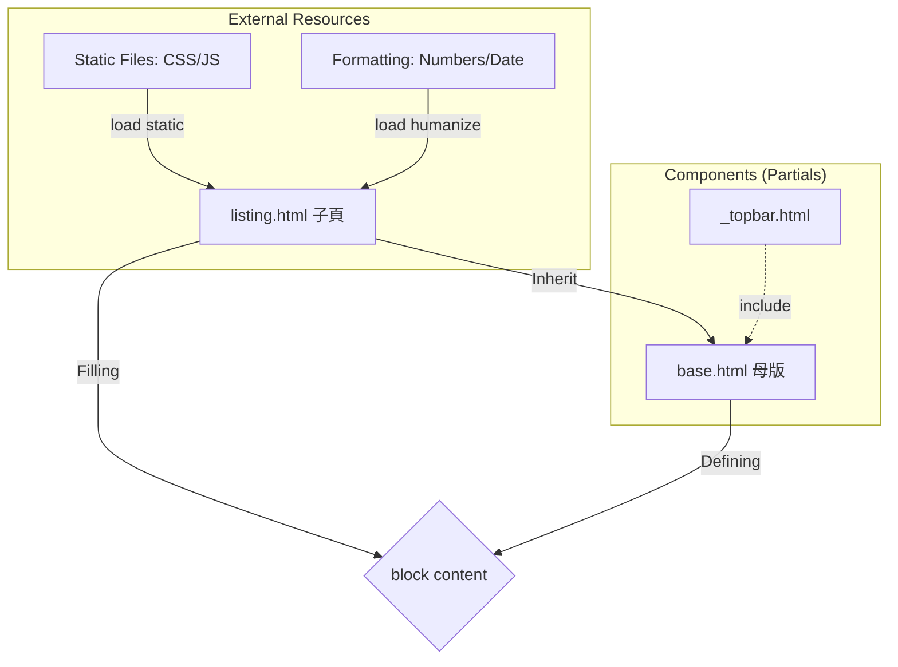
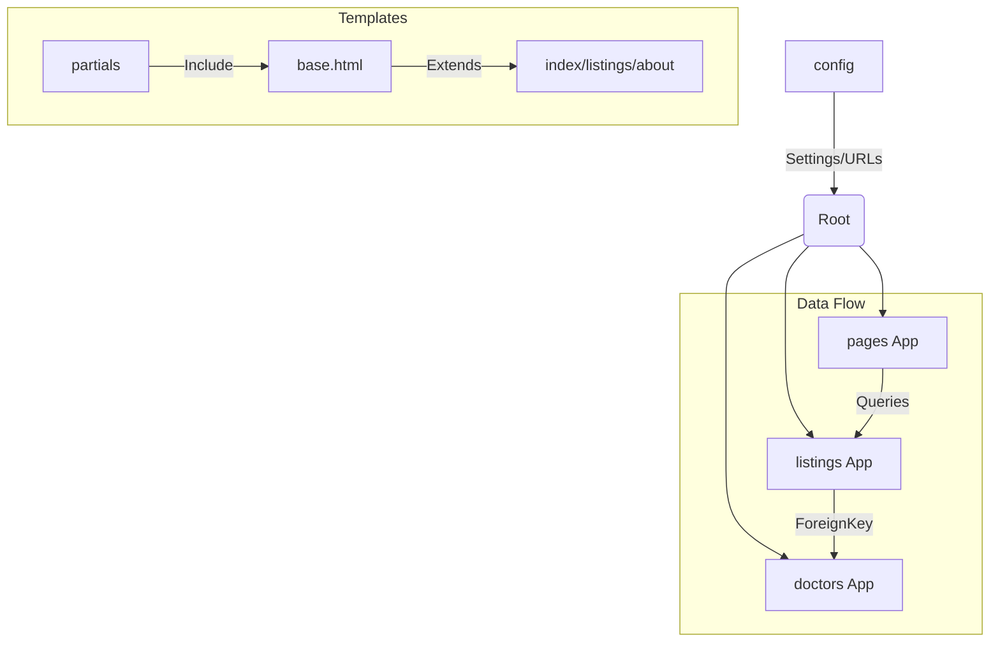

models 定義資料、views 處理邏輯、templates 渲染畫面

ORM：all()、filter() and get_object_or_404

 和  to make dynamic image and pages

（邏輯）和 {{ variable }}（變數）

|標籤 |角色 |一句話功能說明|
| 組件導入 |將獨立的小檔案（如 Topbar）直接嵌入目前位置，達到代碼重複使用。
| 繼承母版 |宣告此頁面是某個母版的「分身」，必須放在檔案的最頂部。
 |挖窿/填窿 |在母版中預留空間（挖窿），或在子網頁中填入內容（填窿）。
 |資源連接 |授權頁面使用  標籤來讀取圖片、CSS 或 JavaScript 檔案。
 |格式化工具 |啟用 Django 內建工具，將生硬的數字或日期轉化為「人類友好」格式（如加逗號）。

---

| 標籤                | 角色       | 一句話功能說明                                                               |
| ------------------- | ---------- | ---------------------------------------------------------------------------- |
|    | 組件導入   | 將獨立的小檔案（如 Topbar）直接嵌入目前位置，達到代碼重複使用。              |
|    | 繼承母版   | 宣告此頁面是某個母版的「分身」，必須放在檔案的最頂部。                       |
|      | 挖窿/填窿  | 在母版中預留空間（挖窿），或在子網頁中填入內容（填窿）。                     |
|    | 資源連接   | 授權頁面使用  標籤來讀取圖片、CSS 或 JavaScript 檔案。           |
|  | 格式化工具 | 啟用 Django 內建工具，將生硬的數字或日期轉化為「人類友好」格式（如加逗號）。 |

---

---

1. 專案架構概覽 (Mermaid Diagram)
   你的專案採用了標準的 Django MVT 架構，並透過 config 資料夾進行全局管理。

2.

- 核心技術亮點
  🔧 後端配置 (Config & Settings)
  - 環境安全性：使用 .env 隱藏 SECRET_KEY 和 DATABASE_URL，避免敏感資訊流出。
  - 靜態與媒體檔案：
  - STATICFILES_DIRS 專門存放 UI 的 CSS/JS。
  - MEDIA_ROOT 存放用戶上傳的圖片（如診所照片、醫生頭像）。
  - 重要修正紀錄：在 config/urls.py 結尾必須加上 + static(settings.MEDIA_URL, ...) 否則圖片會報 404 錯誤。
- 🏥 診所管理 (Listings App)
  - 模型設計 (Model)：
    - 使用了 photo_main 及多個可選圖片欄位 (photo_1 ~ photo_4)。
    - Meta 類別中定義了 ordering = ['-list_date']，確保新診所自動排在最前面。
  - Admin 自定義：
    - list_editable：讓你不用進入編輯頁面就能直接切換「是否發佈」和「房間數量」。
    - search_fields：支援標題、行政區和醫生姓名搜索。
- 📄 分頁與動態渲染 (Views & Templates)
  - 分頁器 (Paginator)：
    - 在 views.py 限制每頁顯示 3 筆資料。
    - 在 listings.html 配合 has_other_pages 邏輯，實現了包含「上一頁、下一頁、數字跳頁」的高級導航欄。
  - 模板標籤技巧：
    - humanize：用於將費用數字加逗號 (intcomma)。
    - timesince：顯示資料發佈了多久（如：2 days ago）。

3. 實戰問題解決紀錄 (Debug History)
   |問題|現象|解決方案|
   |-|-|-|
   TemplateSyntaxError | 報錯在 endblock 或 endif | 檢查  是否成對出現，避免在 img 標籤內寫邏輯。
   Media 404 | 瀏覽器找不到圖片|在 urls.py 加入媒體檔案路由連接。
   Responsive Issue | 電腦版顯示空白 | 修正 div 標籤閉合問題，確保 col-md-9 與 col-md-3 同屬一個 row。
   Variable Mapping | 詳情頁沒資料 | views.py 傳遞 Context 時使用單數 listing 與模板對應。

4. 下一步開發建議 (Future Features)

- 實作 Inquiry 表單提交：

  - 目前 Modal 內只有 HTML form，需在 views.py 增加一個處理 POST 請求的 Function，將查詢存入新建立的 Inquiry Model。

- 搜尋篩選功能 (Search Logic)：

  - 在 search.py 中接收 URL 參數（如 ?district=Kowloon&rooms=2），並對 Listing.objects.filter() 進行條件累加。

- 用戶認證系統 (Auth)：
  - 開發註冊、登入頁面，讓登入後的用戶能直接看到自己的詢問紀錄。
