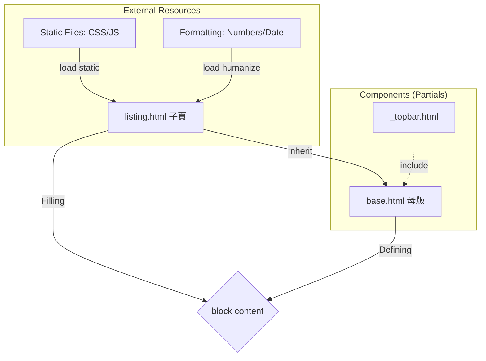
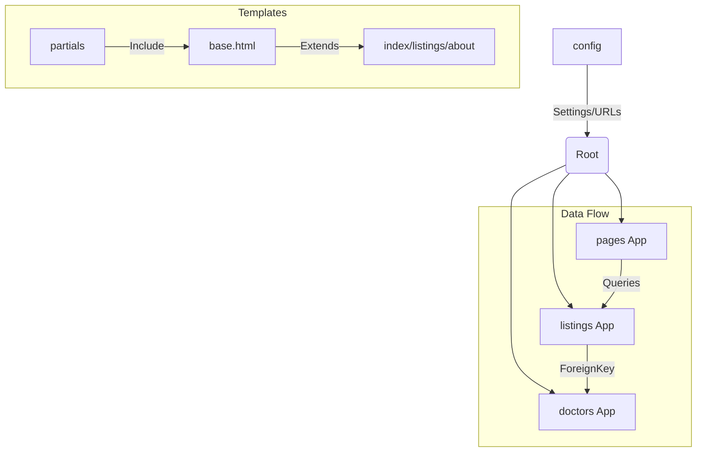

models 定義資料、views 處理邏輯、templates 渲染畫面

ORM：all()、filter() and get_object_or_404

 和  to make dynamic image and pages

（邏輯）和 {{ variable }}（變數）



|標籤 |角色 |一句話功能說明|
| 組件導入 |將獨立的小檔案（如 Topbar）直接嵌入目前位置，達到代碼重複使用。
| 繼承母版 |宣告此頁面是某個母版的「分身」，必須放在檔案的最頂部。
 |挖窿/填窿 |在母版中預留空間（挖窿），或在子網頁中填入內容（填窿）。
 |資源連接 |授權頁面使用  標籤來讀取圖片、CSS 或 JavaScript 檔案。
 |格式化工具 |啟用 Django 內建工具，將生硬的數字或日期轉化為「人類友好」格式（如加逗號）。

---


| 標籤                | 角色       | 一句話功能說明                                                               |
| ------------------- | ---------- | ---------------------------------------------------------------------------- |
|    | 組件導入   | 將獨立的小檔案（如 Topbar）直接嵌入目前位置，達到代碼重複使用。              |
|    | 繼承母版   | 宣告此頁面是某個母版的「分身」，必須放在檔案的最頂部。                       |
|      | 挖窿/填窿  | 在母版中預留空間（挖窿），或在子網頁中填入內容（填窿）。                     |
|    | 資源連接   | 授權頁面使用  標籤來讀取圖片、CSS 或 JavaScript 檔案。           |
|  | 格式化工具 | 啟用 Django 內建工具，將生硬的數字或日期轉化為「人類友好」格式（如加逗號）。 |

---

---

1. 專案架構概覽 (Mermaid Diagram)
   你的專案採用了標準的 Django MVT 架構，並透過 config 資料夾進行全局管理。



2.

- 核心技術亮點
  🔧 後端配置 (Config & Settings)
  - 環境安全性：使用 .env 隱藏 SECRET_KEY 和 DATABASE_URL，避免敏感資訊流出。
  - 靜態與媒體檔案：
  - STATICFILES_DIRS 專門存放 UI 的 CSS/JS。
  - MEDIA_ROOT 存放用戶上傳的圖片（如診所照片、醫生頭像）。
  - 重要修正紀錄：在 config/urls.py 結尾必須加上 + static(settings.MEDIA_URL, ...) 否則圖片會報 404 錯誤。
- 🏥 診所管理 (Listings App)
  - 模型設計 (Model)：
    - 使用了 photo_main 及多個可選圖片欄位 (photo_1 ~ photo_4)。
    - Meta 類別中定義了 ordering = ['-list_date']，確保新診所自動排在最前面。
  - Admin 自定義：
    - list_editable：讓你不用進入編輯頁面就能直接切換「是否發佈」和「房間數量」。
    - search_fields：支援標題、行政區和醫生姓名搜索。
- 📄 分頁與動態渲染 (Views & Templates)
  - 分頁器 (Paginator)：
    - 在 views.py 限制每頁顯示 3 筆資料。
    - 在 listings.html 配合 has_other_pages 邏輯，實現了包含「上一頁、下一頁、數字跳頁」的高級導航欄。
  - 模板標籤技巧：
    - humanize：用於將費用數字加逗號 (intcomma)。
    - timesince：顯示資料發佈了多久（如：2 days ago）。

3. 實戰問題解決紀錄 (Debug History)
   |問題|現象|解決方案|
   |-|-|-|
   TemplateSyntaxError | 報錯在 endblock 或 endif | 檢查  是否成對出現，避免在 img 標籤內寫邏輯。
   Media 404 | 瀏覽器找不到圖片|在 urls.py 加入媒體檔案路由連接。
   Responsive Issue | 電腦版顯示空白 | 修正 div 標籤閉合問題，確保 col-md-9 與 col-md-3 同屬一個 row。
   Variable Mapping | 詳情頁沒資料 | views.py 傳遞 Context 時使用單數 listing 與模板對應。

4. 下一步開發建議 (Future Features)

- 實作 Inquiry 表單提交：

  - 目前 Modal 內只有 HTML form，需在 views.py 增加一個處理 POST 請求的 Function，將查詢存入新建立的 Inquiry Model。

- 搜尋篩選功能 (Search Logic)：

  - 在 search.py 中接收 URL 參數（如 ?district=Kowloon&rooms=2），並對 Listing.objects.filter() 進行條件累加。

- 用戶認證系統 (Auth)：
  - 開發註冊、登入頁面，讓登入後的用戶能直接看到自己的詢問紀錄。

---

31/12/2025
Modify Queryset > pages > view.py

```python
def about(request):
  # return HttpResponse('<h1>about</h1>')
  doctors = Doctor.objects.order_by('-hire_date')[:3]
  mvp_doctors = Doctor.objects.all().filter(is_mvp=True)
  total_mvp = mvp_doctors.count()
  context = {"doctors":doctors,"mvp_doctors":mvp_doctors}
  return render(request,'pages/about.html',context)
```

modify pages > urls.py

```python
from django.urls import path
from  . import views

app_name = 'pages' # Django 4.2之後加app_name

#define the end point : index , about. Do it in views.py
urlpatterns = [
  path('',views.index,name = 'index'),
  path('about',views.about,name='about'),
  # path('listings',views.listing,name='listings'),
]
```

Command in pages > views.py

```python
path('listings',views.listing,name='listings'),
```

```python
from django.urls import path
from  . import views

app_name = 'pages' # Django 4.2之後加app_name

#define the end point : index , about. Do it in views.py
urlpatterns = [
  path('',views.index,name = 'index'),
  path('about',views.about,name='about'),
  # path('listings',views.listing,name='listings'),
]
```

And command in pages > views.py

```python
def listing(request):
  return render(request,'pages/listings.html')
```

---

Build search.py now
under folder listings , build a choices.py
copy search.html to choices.py , under choices.py , build a tribe :

```html
<option value="IL">Islands</option>
<option value="KT">Kwai Tsing</option>
<option value="NR">North</option>
<option value="SK">Sai Kung</option>
<option value="ST">Sha Tin</option>
<option value="TP">Tai Po</option>
<option value="TW">Tsuen Wan</option>
<option value="TM">Tuen Mun</option>
<option value="YL">Yuen Long</option>
<option value="KC">Kowloon City</option>
<option value="KW">Kwun Tong</option>
<option value="SS">Sham Shui Po</option>
<option value="WT">Wong Tai Sin</option>
<option value="YM">Yau Tsim Mong</option>
<option value="CW">Central & Western</option>
<option value="ER">Eastern</option>
<option value="SR">Southern</option>
<option value="WC">Wan Chai</option>
```

| 屬性           | 說明               | 例子                              |
| -------------- | ------------------ | --------------------------------- |
| request.method | 用什麼方式請求     | GET (拿資料), POST (傳資料)       |
| request.GET    | 網址列後面的參數   | ?keywords=clinic&district=Islands |
| request.POST   | 表單提交的隱藏資料 | 用戶輸入的密碼、電話等            |
| request.path   | 目前的網址路徑     | /listings/search/                 |
| request.user   | 目前登入的用戶     | 如果沒登入就是 AnonymousUser      |
| request.FILES  | 用戶上傳的檔案     | 圖片、PDF 等                      |

---

### Django ORM Field Lookups:

| 規則        | 全寫 / 類型                  | 意義                   | 程式碼範例                         | 查詢效果說明                                |
| ----------- | ---------------------------- | ---------------------- | ---------------------------------- | ------------------------------------------- |
| exact       | Exact                        | 精確匹配               | id\_\_exact=5                      | 必須完全等於 5，通常用於 ID 或特定編號。    |
| iexact      | Case-insensitive exact       | 精確匹配 (不分大小寫)  | name\*\*iexact='oscar'             | 'Oscar'、'OSCAR'、'oscar' 均符合條件。      |
| contains    | Contains                     | 包含                   | title\*\*contains='Clinic'         | 只要標題中含有 'Clinic' (區分大小寫) 即可。 |
| icontains   | Case-insensitive contains    | 包含 (不分大小寫)      | title\*\*icontains='yoho'          | 'YOHO'、'Yoho'、'yoho' 均會被搜尋到。       |
| startswith  | Starts With                  | 以...開頭              | phone\*\*startswith='2'            | 找出所有以 '2' 字開頭的電話號碼。           |
| istartswith | Case-insensitive starts with | 以...開頭 (不分大小寫) | code\*\*istartswith='a'            | 找出所有以 'A' 或 'a' 開頭的編號。          |
| endswith    | Ends With                    | 以...結尾              | email\*\*endswith='.com'           | 找出所有以 '.com' 結尾的電子郵件。          |
| iendswith   | Case-insensitive ends with   | 以...結尾 (不分大小寫) | file\*\*iendswith='.JPG'           | 找出 '.jpg' 或 '.JPG' 結尾的圖片檔案。      |
| lte         | Less Than or Equal           | 小於等於 ($\le$)       | rooms\*\*lte=3                     | 搜尋房間數等於 3、2、1 或 0 的記錄。        |
| gte         | Greater Than or Equal        | 大於等於 ($\ge$)       | rooms\*\*gte=2                     | 搜尋房間數等於 2 或以上的記錄。             |
| lt          | Less Than                    | 小於 ($<$)             | price\*\*lt=1000                   | 搜尋價格低於 1000 的診所 (不含 1000)。      |
| gt          | Greater Than                 | 大於 ($>$)             | price\*\*gt=1000                   | 搜尋價格高於 1000 的診所 (不含 1000)。      |
| in          | In List                      | 列表匹配               | district\*\*in=['North', 'Tai Po'] | 只要行政區是 'North' 或 'Tai Po' 均符合。   |
| range       | Range                        | 範圍搜尋               | price\*\*range=(500, 1500)         | 找出價格在 500 到 1500 之間的所有記錄。     |
| isnull      | Is Null                      | 空值檢查               | photo_1\*\*isnull=True             | 找出那些「沒有上傳」第一張照片的資料。      |

---

Q Object (Django handle「OR」logic )

```python
from django.db.models import Q
```

Example:

```python
  if 'keywords' in request.GET:
    keywords = request.GET['keywords']
    if keywords:
      # queryset_list = queryset_list.filter(title__icontains=keywords)
      queryset_list = queryset_list.filter(
                Q(title__icontains=keywords) |
                Q(description__icontains=keywords)|
                Q(doctor_name__icontains=keywords)
            )
```

| 符號  | 邏輯     | 說明               | 例子                          |
| ----- | -------- | ------------------ | ----------------------------- |
| \*\*` | `\*\*    | OR (或)            | 其中一個條件成立即可          |
| &     | AND (且) | 兩個條件都必須成立 | Q(A) & Q(B) (同一般的 filter) |
| ~     | NOT (非) | 排除符合條件的記錄 | ~Q(A) (排除 A)                |

---

Usage of double '\_ \_' :
|Function|Example|
|-|-|
Lookups（查詢規則）|如 **icontains, **iexact, \_\_gte。
Relationships（關聯跳轉）|用來進入另一個 Model 的欄位。

---

## Finally :

```python
district_choices = {
...
}

sorted_districts = sorted(district_choices.items(),key= lambda x:x[1])
```

```python
from listings.choices import sorted_districts,bedroom_choices,room_type_choices
def index(request):
  listings = Listing.objects.order_by('-list_date').filter(is_published=True)[:3] # [:3] -> list -> 0,1,2
  context = {'listings' : listings,
    'sorted_districts': sorted_districts,
    'bedroom_choices':bedroom_choices,
    'room_type_choices':room_type_choices
}
```

```html

                  <option value="{{ key }}"  selected >
                  {{ value }}
                  </option>
                  
```

---
