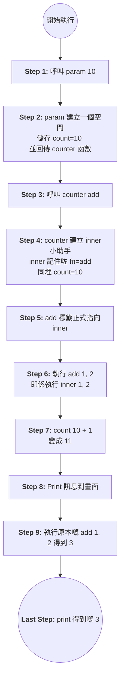

---

**Step 1: Pass 咗啲乜？**
當你行 `add = param(10)(add)` 嘅時候，其實係分咗兩步：

`param(10)`: 你 pass 咗整數 `10` 入去。呢一吓會產生一個「環境」，入面嘅 `count` 係 `10`。佢回傳咗 `counter` 呢個函數出嚟。

`(add)`: 隨即你將 `add` function pass 入去頭先回傳嗰個 `counter` 度。呢一吓會產生 `inner，而呢個` `inner` 係睇到 `count=10` 嘅。

**Last Step: Output 咗啲乜？**
最後 `print(add(1, 2))` 會喺畫面出現兩行嘢：

第一行（由 `inner` 入面嘅 `print` 產生）： F`unction add called 11 times` (因為 `nonlocal count` 由 10 加咗 1，所以係 11)

第二行（由最外面嘅 `print` 產生）： `3` (因為 `fn(1, 2)` 回傳咗 3，最後被最外面層 print 出嚟)

點解要咁寫？（三層結構）
第一層 `param`: 係「設定層」。用嚟決定計數器由幾多開始計（例如你想由 0 開始定由 10 開始）。

第二層 `counter`: 係「裝修層」。負責接收你要裝飾嘅 function。

第三層 `inner`: 係「執行層」。每次你叫 `add()` 佢都會行，負責計數同叫原本部機做嘢。

---

## Python Designing Pattern != Java Designing Pattern

```python
@param()
def add(a,b=0):
return a+b

@param()
def mult(a,b=1):
return a\*b

Ab()
Ac() ,可以獨立改A，b,c ,factor out function
```
