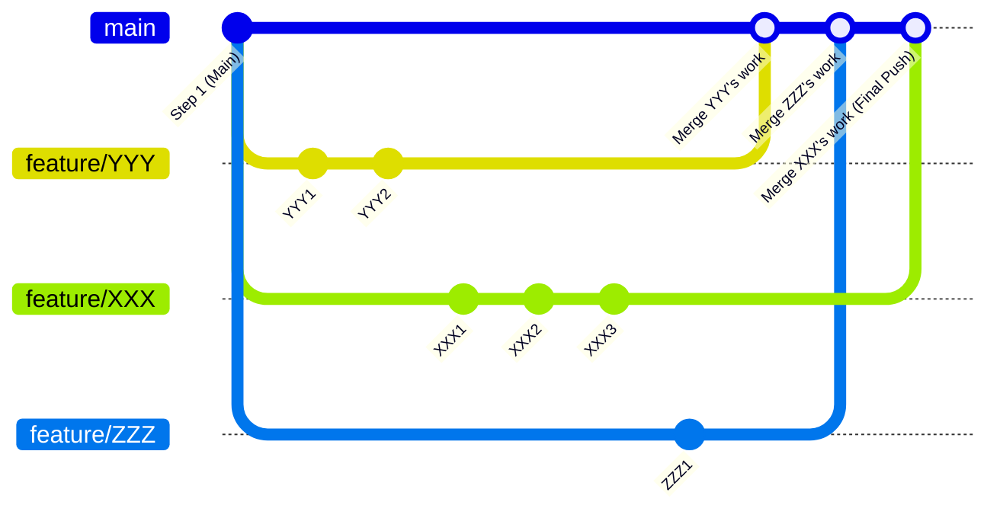
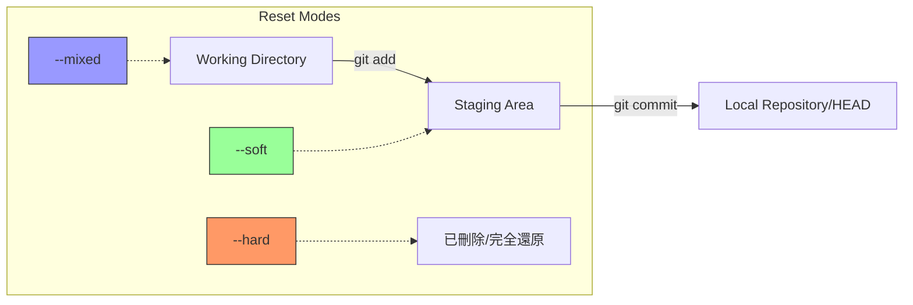
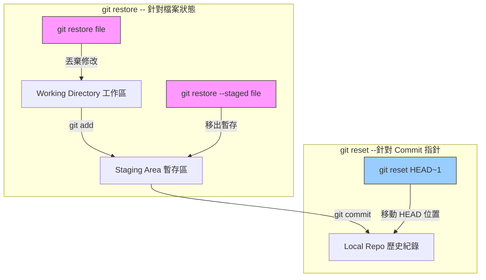

git branch
-> master

---

-> main (Last branch)
->Step 1 (變左 Main)
幾個人 start at Step1

每個人 create 屬於自己既 Branch ：

````

---

1. 專業命名公式 (Prefix Convention)最標準嘅做法係用 「類別 / 功能名稱」 或者 「類別 / 開發者名 / 功能」。A. 簡單直覺版：按功能分類如果你哋 Team 唔大，直接用功能分類就得：feature/ : 新功能 (例如 feature/login-page)fix/ 或 bugfix/ : 修復 Bug (例如 fix/header-overlap)hotfix/ : 緊急修復（通常指直接喺 Production 發現嘅大鑊嘢）refactor/ : 重構代碼（冇加新功能，只係寫得靚啲）docs/ : 只係改文件B. 多人協作版：加上開發者個名（推薦！）為咗一眼睇出個 Branch 邊個開，可以喺前面加多一層：格式： 類別/名-功能例如： * feature/ken-add-cartfix/mary-navbar-colorrefactor/tom-api-logic

---

2. 點解要咁樣命名？ (30歲版職場思維)想像 Git Branch 命名就係**「公司嘅入數單據」**：可追溯性：三個月後見到個 feature/payment-gateway，你即刻知呢度係整緊畀錢功能。避免衝突：如果兩個人都想改 Navbar，一個叫 mary/nav，一個叫 ken/nav，就唔會因為 Branch 撞名而推唔到 Code。自動化友善：好多專業工具（例如 Jenkins, GitHub Actions）可以根據你的 Prefix（如 feature/*）自動行測試，幫你慳返好多手動功夫。

---

3. 實戰建議清單 (Markdown Table)情況建議命名解釋你要整新嘢feature/yourname-task清楚知道邊個喺度開發緊咩功能。你要改錯字 / 小 Bugbugfix/issue-id如果有 Jira 或 Trello，可以用返個 Task ID（如 bugfix/102-typo）。你想試新嘢（可能唔要）experiment/try-new-api話畀人聽呢個 Branch 係實驗性質，唔好隨便 Merge。你要更新 Readmedocs/update-guide唔關 Code 事，純粹更新文件。

---

💡 額外小貼士 (Best Practices)
- 全細寫：Git 對大細寫有時會混亂，建議統一用細寫。
- 用橫線 - 而唔係底線 _：喺 URL 網址或者終端機睇起嚟更清楚。
- 唔好太長：雖然要清楚，但唔好寫成 ```feature/ken-fix-the-navbar-color-on-iphone-15-pro-max```，簡短扼要就得。
````

---

1. `git branch`
2. `git switch XXX`(by person)
3. Someone `git switch ZZZ` -> `git commit` (Someone 認領左 branch ZZZ)
4. 最後有一個人`git merge`

---

YYY local :
main --> YYY1 --> YYY2

XXX local :
main --> XXX1 --> XXX2 --> XXX3

ZZZ local :
main --> ZZZ1

PM(XXX) `git pull YYY` ,`git pull ZZZ`
XXX local:
main --> XXX1 --> XXX2 --> XXX3 --> `git merge origin`
main --> origin/YYY1 --> origin/YYY2 --> `git merge origin`
main --> origin/ZZZ1 --> `git merge origin`

YYY2 and ZZZ1 merge to XXX3, 再`git push -u origin main`
XXX3 , YYY2, ZZZ1 --> group to main branch

---

---

Git 多人協作分支管理指南

#### 1. 專案初始狀態所有開發者由 main 分支（原 master）出發，並基於 Step 1 的狀態開始各自的工作。

#### 2. 專業命名規範 (Naming Convention)為咗方便管理，我哋採用 「類別/名-功能」 的命名格式：類別命名範例適用場景 Featurefeature/xxx-login 開發新功能 Bugfixbugfix/yyy-header 修復已知 BugRefactorrefactor/zzz-api 重構代碼（不影響功能）Docsdocs/readme-update 僅更新文件

#### 3. 開發者 Git Flow 協作流程 (Mermaid 視覺化)以下展示 XXX (PM/整合者)、YYY 與 ZZZ 三人的開發路徑，以及最後如何匯總至 main：程式碼片段



#### 4. 實戰指令步驟 (Step-by-Step)

##### 第一步：同步與切換分支每位開發者先確保本地有最新代碼，並建立自己的分支：

```Bash
git checkout main
git pull origin main
git switch -c feature/yourname-task
```

##### 第二步：開發與提交 (Local)在各自的分支上進行開發：YYY: commit YYY1 -> commit YYY2XXX: commit XXX1 -> commit XXX2 -> commit XXX3ZZZ: commit ZZZ1 第三步：整合與合併 (PM/Leader 角色)當所有人完成後，由 XXX (PM) 負責將各分支內容拉取 (Pull) 並合併 (Merge) 到本地 main：切換回 Main: git checkout main 合併 YYY: git pull origin feature/YYY (將遠端 YYY 的進度拉入本地 main)合併 ZZZ: git pull origin feature/ZZZ 解決衝突 (Conflicts): 如果 XXX3 與其他提交有撞位，需手動修正。推送最終結果:Bashgit push -u origin main

💡 核心重點小貼士全細寫、用橫線 -：例如 feature/ken-add-cart，唔好用大細寫混合或底線。先 Pull 後 Push：喺 Merge 之前，一定要先 git pull 攞咗最新嘅 code 翻嚟先，減少 Conflict 大爆發嘅機會。原子提交 (Atomic Commit)：一個 Commit 只做一件事，唔好將成個星期嘅 code 一次過塞入一個 commit。

---

### Git:

支箭綠色：working directory ,Staging Area ,Repository(local Repository) 係一樣，同一個 directory
Working Directory(local):(untracked file) manage.py -> `git add.` ,then pass to `Staging Area`

Staging Area: can `git reset` to local

Repository(local Repository) : `git commit` from Staging Area to Repository (but this Repository is local , not git Repository)

Repository(Remote Repository):`git push` form Repository(local) to Repository(Remote Repository)
`git pull` form Repository(Remote Repository) to Repository(local)

---

### Basics

#### You can create a repository with either of the following commands.

| 指令   | 用法                                                                                                        | 用途                                                                                                                     |
| ------ | ----------------------------------------------------------------------------------------------------------- | ------------------------------------------------------------------------------------------------------------------------ |
| clone  | git clone https://github.com/nesi/perf-training.git <br/>or <br/>git clone git@github.com:aaronwai/erb4.git | Copies a remote repository into your current directory.                                                                  |
| init   | git init                                                                                                    | Creates a new empty repo in your current directory.                                                                      |
|        |
| add    | git add <file1> <file2>                                                                                     | Adds <file1> and <file2> to the staging area.                                                                            |
| -      | git add \*.py                                                                                               | Adds all python files in the current directory to the staging area.                                                      |
| status | git status Lists changes in working directory, and staged files.                                            |
| commit | git commit                                                                                                  | Records everything in the staging area to your repository. The default text editor will prompt you for a commit message. |
| -      | git commit -m "Commit message"                                                                              | Records everything in the staging area to your repository with the commit message "Commit message"                       |
| -      | git commit --amend                                                                                          | Modify last commit instead of creating a new one. Useful for fixing small mistakes.                                      |
| log    | git log                                                                                                     | Prints commit history of repo.                                                                                           |
| -      | git log <filename>                                                                                          | Prints commit history of <filename>.                                                                                     |
| reset  | git reset                                                                                                   | Removes all files from staging area. (Opposite of git add)                                                               |
| -      | git reset <filename>                                                                                        | Removes <filename> from staging area.                                                                                    |

---

### Remote

#### By default, fetch, pull and push will operate on the origin repo. This will be the repo you cloned from, or set manually using git branch --set-upstream-to <origin>.

| 指令  | 用法                      | 用途                                                                                                        |
| ----- | ------------------------- | ----------------------------------------------------------------------------------------------------------- |
| fetch | git fetch                 | Gets status of origin. git fetch does not change your working directory or local repository (see git pull). |
| -     | git fetch <repo> <branch> | Get status of <repo> <branch>.                                                                              |
| pull  | git pull                  | Incorporates changes from 'origin' into local repo.                                                         |
| -     | git pull <repo> <branch>  | Incorporates changes from <repo> <branch> into local repo.                                                  |
| push  | git push                  | Incorporates changes from local repo into origin.                                                           |
| -     | git push <repo> <branch>  | Incorporates changes from local repo into <repo> <branch>                                                   |

---

### Branches

#### At an introductory level, it is best to avoid workflows that lead to multiple branches, or requires merging.

| 指令     | 用法                       | 用途                                     |
| -------- | -------------------------- | ---------------------------------------- |
| branch   | git branch                 | List branches.                           |
| -        | git branch <branch-name>   | Create new branch <branch-name           |
| checkout | git checkout <branch-name> | Switch to editing branch <branch-name>   |
| merge    | git merge <branch-name>    | Merge <branch-name> into current branch. |

---

### erb4:

`git status` -> 睇 local 係咩 branch

`main ? 'upper arrow' 5 'downer arrow' 7`
`upper arrow` :
`downer arrow` :

Example : 2 file untracked
?->`Untracked file` , need `git add` to track the file
how to backup ones of the file?
`git add xxx.yyy(file name)`

`git status` again
only one file untracked

`changes to be commit:`
`use git restore --staged <file> ..." to unstage`

## 小心 `git restore`：

`git restore`: `git restore --staged <file name>`
`git restore` :

3 個可能性：

1. Staging Area -> Working Directory
2. Local Repo -> Staging Area
3. Local Repo -> Working Directory

## 有機會 overwrite file，用 empty file overwrite

`rm <file>` -> delete file
再`ls -l` , `'file` was delete

1. 一係 delete staging area's file
2. 係 staging area `git restore 'file name'`

Fail to delete : `git rm 'file name'`:

---

`error : the following file has changes staged in te index:
'file name'
(use --cached to keep the file, or -f to force removal)`

Success delete file : `git rm -f 'file name'`

Create file :
`git ls-files erb9.txt`
or
`echo "write some Context" > 'file name'` ,'>' 加 D 野

`echo "write some Context" >> 'file name'`,'>>' append new line

---

Check how many files in Staging Area :
`git ls-files`
check specific file :
`git ls-files <<file name>>`

Delete Staging Area file , 唔會 delete local Working Directory:
`git rm --cached -rf erb8.txt`

---

`git ls-files erb9.txt`
改 file name:
`mv erb9.txt erb9`

---

1. `mv erb9.txt erb9`
2. `git ls-files erb9.txt` , result : erb.txt
3. `git add erb9.txt` , 加個空 file 落 staging area
4. `git ls-files erb9.txt` , result : show nothing
5. `git add erb9`
6. `git ls-files erb9`

---

`git status -s` : s : short hand , result :
A erb9
?? erb8.txt

第一行 ： staging area
第二行：working directory

加入 staging area：
`git add erb8.txt`
再`git status -s` , result :
A erb8.txt
A erb9

人手 modify file,
`git status -s` ,result:
A erb8.txt
AM erb9 , A -> Add , M -> Modify,master 出圓圈 ⭕️
`git add erb9`
`git status -s` , result:
A erb8.txt
A erb9

---

`git diff` -> 睇邊個 file 邊行改左

`git log` -> show commit 過咩

`git log --oneline` -> 睇到 message 同 git push number

`git log --oneline --reverse` 同`git log --oneline`，但排序由新到舊

`git log --oneline --stat` 睇到每個 commit 改左乜

`git log --oneline --patch` ,show all code
但太長，所以
`git log --oneline -3` , 睇最近個 3 個 commit

Filter：
`git log --oneline --author="'author name'"` , short by author name

`git log --oneline --author="email"` , short by email

`git log --oneline --after="three months ago"` (3 個月前到今日)

`git log --oneline a45e..6611` ,用 number 搵 git push number

`git show HEAD-2`,睇下個頭指住乜 number result :123456 (HEAD->)...

`git show 25f9` / `git show 6611` ,

`git log --online --all` , 睇晒 all branch

`git checkout master` , 倒帶去番 master branch

---

`git merge origin/master` , 但要 commit 左先可以 merge ,想 force `git merge`要行`git stash` : add 完唔想 commit，可以 run`git stash`

`git stash apply` , `git pull`完要打，令到 working directory 可以令 file 一置

`git stash apply`完，打`git stash pop` , delete `git stash` record

---

## 16/01/2026

### Detached Head

Reason of create new branch :
for testing something : version 1 ,version 2 , Diff ppl

`git checkout head-2` , 倒帶 2 個 version

`git log --oneline --all --graph`, show all git tree, which branch merge to which branch

Force delete branch :
`git branch -D 'branch name'`

`git branch` : show all branch

reason of delete branch : 以為有 D branch 未 merge, 一下子 merge 晒落 main 就仆街
`git branch -d 'branch name'` , result : `Deleted branch 'branch_name'`

`git bisect start` , start the `bisect`
then define node :`git bisect bad` :`status : waiting for good commit(s),bad commit know `

why use `bisect` mode ? 發現呢條 branch 有 bug,但唔知邊度入黎，mark 低條 branch，再`git checkout` , finally `git bisect good 'branch number'` , result : `Bisecting: XX revisions left to test after this (roughly 5 stage)
AAA BBB CCC DDD EEE modified `

`git log --oneline --all --graph` : 個 HEAD 會去左 last commit version

bad 係 last version，中間 cut 開一半，如果 define 做 good，
再係 bad 同 define 既 good 中間再 cut 開做 bisect，再重覆呢個動作

if good ,no bug : `git bisect reset`

`git stash` : `Saved working directory and index state WIP on django: 'branch name' Update 'xxx.filetype'  with remote branch message`

`git stash list` :

---

`Fast forward merge`
init --> Main /FrontEnd , HEAD 指住 FrontEnd
commit --> FrontEnd向前移，再commit --> FrontEnd再向前移

HEAD --> Master --> Next Branch
Next Branch --> Next Next Branch
Feature --> Next Next Next Branch
Next Next Next Branch --> Next Next Next Next Branch

`git stash drop 0` : drop branch

`git merge 'Other Branch Name'` : need switch to master branch , then `git merge 'Other Branch Name'` , other branch will merge to `master` branch.
Result : will see Fast-Forward, then will see other file +++++-----

After merge , you can delete the merge branch ,because its finish the mission : Example : erb8

After delete , you can create a new branch named 'the same name' : Example : erb8

`git branch erb9` --> create new branch
do these step in `master` branch:
`git log --oneline --all -graph` --> check all branch named
create new file : erb11 , type : `no conflict merge demo` , main purpose : show no conflict
`git add .`
`git commit -m "something"`
`git log --oneline --all --graph`
Main 會行多一步

Switch to `erb9` branch
create new file named `erb12`,type : `demo for no conflict merge`
show `no conflict merge` :
`git add .`
`git commit -m "something"`

Both branch has new file : `erb9` in `master` , `erb12` in `erb9` branch
`git log --oneline --all --graph` will show 2 line

switch to `master` branch , and show `MERGE_MSG.git` : type some message :``Merge branch `demo for no conflict merge``

`git merge erb9` : result : `Merge made by the 'ort` stagey

---

Delete `erb9` branch : `git stash drop erb9`
Show `Conflict Merge`:
Type `conflict merge demo at master branch` in `erb12` at `master` branch

1. git add .
2. git commit -m "create conflict demo"

---

後悔merge:
`git merge --abort`

`git reset`

1. `git reset --HARD HARD-1` --> 去番上一步,所有file還原到merge之前:keep `git commit`
2. `git reset --SOFT HARD-1` , --> 去番上一步，commit之前，`git add .` state
3. `git reset --MIXED` , default state : 唔打--HARD,--SOFT

4. `git reset --hard HEAD~1` (最徹底)
   這會將所有內容還原到上一個版本
   係上一個 commit 之後做的所有修改都會消失

```
Commit History: 回到前一格
Staging Area (Index): 清空，回到前一格的狀態
Working Directory: 檔案內容直接變回舊版，新增的 code 會不見
```

2. git reset --soft HEAD~1 (最溫和)
   只會撤銷 git commit ,modified code 會keep係 Staging Area

```
Commit History: 回到前一格
Staging Area (Index): 保留，維持在 git add 之後的狀態
Working Directory: 保留，你的程式碼還在
```

用途： 發現 `commit message` 打錯，或者想把幾次小 commit 合併成一個大的

3. git reset --mixed HEAD~1 (預設模式)
   只打 git reset HEAD~1，預設係這個,它會撤銷 commit 和 git add

```
Commit History: 回到前一格
Staging Area (Index): 清空，回到未 add 的狀態
Working Directory: 保留，你的程式碼還在，但檔案會顯示為 "untracked/modified"
```



| 模式    | 撤銷 Commit | 撤銷 git add (Index) | 撤銷修改 (Worktree) | 常用情境                    |
| ------- | ----------- | -------------------- | ------------------- | --------------------------- |
| --soft  | ✅          | ❌                   | ❌                  | 想重寫 Commit Message       |
| --mixed | ✅          | ✅                   | ❌                  | 發現 add 錯檔案，想重新整理 |
| --hard  | ✅          | ✅                   | ✅                  | 做壞了，想完全推倒重來      |

---

#### 核心區別：檔案級 vs 歷史級

- git restore (檔案級後悔藥)：
  - 對象：針對檔案。

  - 目的：你想丟棄還沒 commit 的修改，或者把檔案從 Staging Area 拿出來。

  - 安全性：它不會移動 HEAD 指針，不會改變 commit 歷史，相對安全。

- git reset (歷史級後悔藥)：
  - 對象：針對 Commit 歷史。

  - 目的：你想讓整個專案「時光倒流」回到某個特定的 commit。

  - 安全性：它會移動 HEAD 指針，直接改寫歷史。



| 你的需求                           | 舊式做法 (git reset / checkout) | 新式做法 (git restore)      |
| ---------------------------------- | ------------------------------- | --------------------------- |
| 取消 git add (把檔案移出暫存區)    | git reset HEAD <file>           | git restore --staged <file> |
| 丟棄工作區修改 (還原成上次 commit) | git checkout -- <file>          | git restore <file>          |
| 回到前一個 Commit                  | git reset --soft HEAD~1         | (仍需使用 git reset)        |
