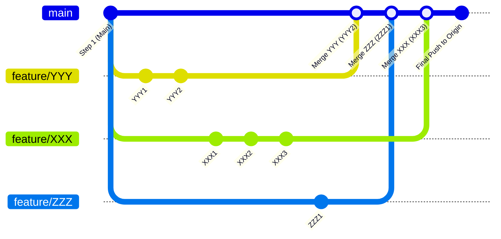
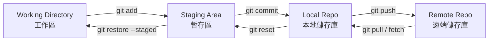
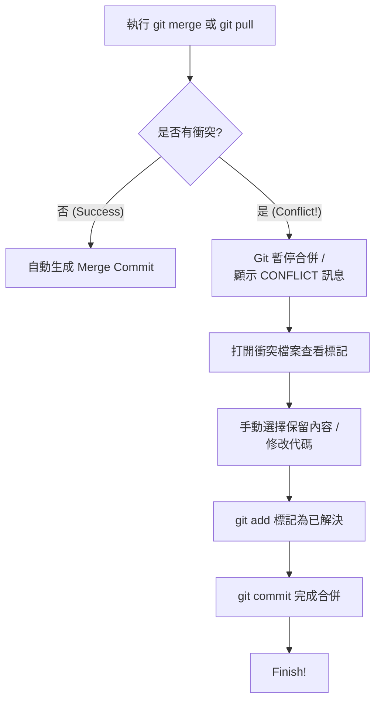
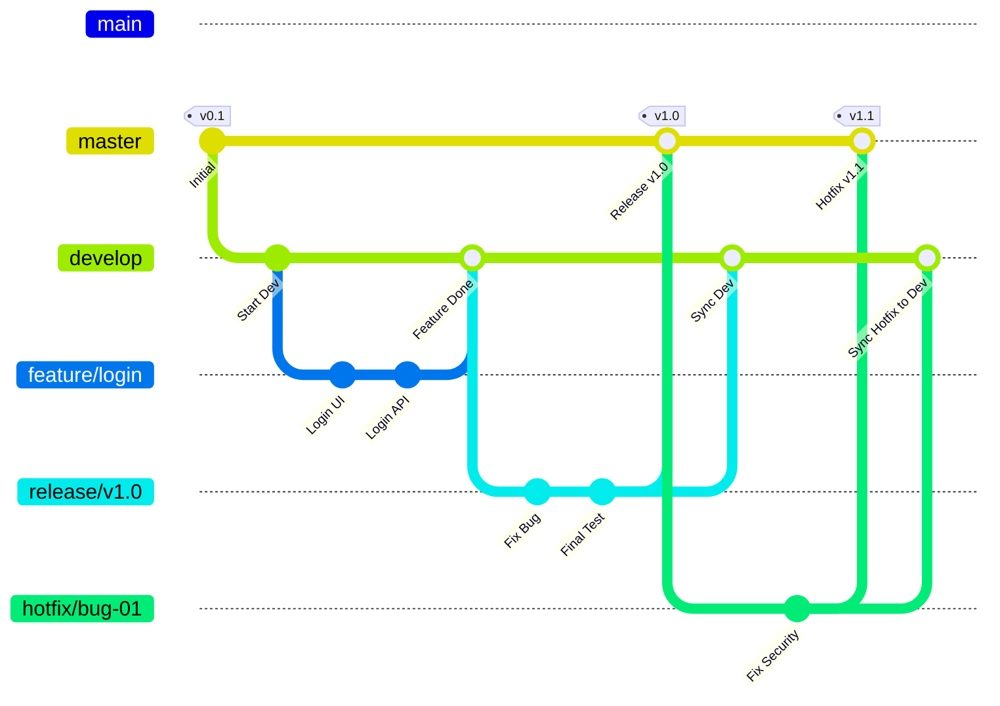

#### Git 多人協作分支管理 (PM 整合版)

Git 三大種類 (Local, Centralized, Distributed)

核心指令 (add, commit, push, pull, log)

復原技巧 (reset, restore, stash)

衝突處理 (merge conflict)

業界標準工作流 (Git Flow)

CI/CD 自動化概念 (GitHub Actions)

---

## Table of Contents

- [Table of Contents](#table-of-contents)
  - [1. 專案分支生命週期](#1-專案分支生命週期)
  - [2. 專業命名與操作流程](#2-專業命名與操作流程)
  - [3. Git 四大區域與檔案流向](#3-git-四大區域與檔案流向)
  - [4. 檔案操作三劍客 (rm, mv)](#4-檔案操作三劍客-rm-mv)
  - [5. 復原專用的「後悔藥」對照表](#5-復原專用的後悔藥對照表)
  - [6. 進階偵錯與檢索 (Bisect / Log)](#6-進階偵錯與檢索-bisect--log)
  - [7. 暫存區管理 (Git Stash)](#7-暫存區管理-git-stash)
  - [8. 版本標籤 (Git Tag)](#8-版本標籤-git-tag)
  - [9. Merge Conflict (合併衝突)](#9-merge-conflict-合併衝突)
  - [10. Git Flow 關鍵角色速查表](#10-git-flow-關鍵角色速查表)
  - [11. 暫存區管理](#11-暫存區管理)

---

#### 1. 專案分支生命週期

所有的開發都由 `main` (Step 1) 出發，每個人在自己的 Branch 戰鬥，最後由 PM (XXX) 統一整合。



---

#### 2. 專業命名與操作流程

命名公式：`類別 / 姓名 - 功能`

- 新功能： `feature/ken-login-page`
- 修復 Bug： `bugfix/mary-navbar-typo`
- 實驗性： `experiment/tom-new-api`

協作實戰步驟 (XXX/PM 視角)

- 認領與切換： `git switch -c feature/XXX-task`
- 開發提交： `git add .` -> `git commit -m "XXX3"`
- 整合他人進度： \* `git checkout main`
  - `git pull origin feature/YYY `(把 YYY 的成果拉下來)
  - `git pull origin feature/ZZZ`
- 最終推送： `git push -u origin main` (將所有人的精華推向遠端)

- 回溯列某個history version：`git checkout commit-hash`

---

#### 3. Git 四大區域與檔案流向

Git 的本質是檔案在不同區域間的搬運與標記。程式碼片段



---

#### 4. 檔案操作三劍客 (rm, mv)

當你需要刪除或移動檔案時，直接用 Git 指令能省去手動 add 的麻煩
指令|用法|效果|
-|-|-
git rm|git rm file.txt|徹底刪除：同時刪除工作區與暫存區的檔案
git rm --cached|git rm --cached file.txt|停止追蹤：刪除暫存區紀錄，但保留工作區的實體檔案（適合把誤加的檔案放入 .gitignore）
git mv|git mv old.txt new.txt|更改名稱/移動：直接完成重新命名並加入暫存區，Git 會識別為 "Renamed"

---

#### 5. 復原專用的「後悔藥」對照表

當你發現做錯時，根據你想「後悔」的程度選擇指令：
需求|指令|效果
-|-|-
移出暫存區|git restore --staged <file>|檔案還在，只是從 Staging 變回 Untracked
丟棄修改|git restore <file>|危險：檔案內容直接變回上次 Commit 的樣子
重寫訊息|git commit --amend|修改最後一次的 Commit 內容或訊息
回到上一步 (Soft)|git reset --soft HEAD~1|撤銷 Commit，但保留代碼在 Staging Area
徹底重來 (Hard)|git reset --hard HEAD~1|極度危險：歷史與代碼全部變回上個版本

---

#### 6. 進階偵錯與檢索 (Bisect / Log)

1. 快速查找歷史
   - `git log --oneline --graph --all`：看全域分支圖（最強常用指令）
   - `git log --after="3 months ago"`：時間篩選
   - `git show HEAD-2`：看前前兩次的改動
2. 比較文件差異
   1. 比較文件different version間既差異： `git diff`
   2. 比較Working Directory同Staging Area之間different： `git diff --staged`
   3. 比較兩個file之間差異：`git diff commit1 commit2`
   4. check file history ,last modifier: `git blame filename`
3. Check Bug(二分Search Bug):
   1. `git bisect start`： 【啟動模式】。告訴 Git 我們要開始玩「猜猜誰是 Bug」的遊戲了。
   2. `git bisect bad HEAD`： 【標記壞點】。告訴 Git 目前的版本（HEAD）是有問題的。
   3. `git bisect good [commit-hash]`： 【標記好點】。告訴 Git 在哪一個特定的 `commit-hash`（或版本號）時，程式還是正常的。
      - 發生了什麼？ 此時 Git 會自動計算中間值，並幫你 `checkout` 到中間的那個 `Commit`。你只需要測試那個版本，看 Bug 還在不在。
      - 如果還有 Bug：輸入 `git bisect bad`。
      - 如果沒 Bug：輸入 `git bisect good`。
      - Git 會重複這個動作，直到定位出第一個壞掉的 Commit。

   4. `git bisect reset`： 【結束退場】。抓到戰犯後，用這個指令回到你原本的分支和最新的進度。

---

#### 7. 暫存區管理 (Git Stash)

當你開發到一半需要緊急切換分支，但又不想提交 (Commit) 未完成的代碼：

- 暫存起來： `git stash` (代碼會變乾淨，可以安心 Switch 分支)
- 看清單： `git stash list`
- 拿回來： `git stash apply` 或 `git stash pop` (拿出來並刪除紀錄)
- 刪除： `git stash drop 0`

---

#### 8. 版本標籤 (Git Tag)

- `git tag v1.0`：給現在的 Commit 貼上版本號
- `git tag -a v2.0 -m "Release Memo"`：附註標籤
- 注意： GitHub 的 Release 頁面通常是抓取 `git tag` 的紀錄。

---

#### 9. Merge Conflict (合併衝突)

**合併衝突處理流程**



---

**點睇衝突標記？**

```mermaid
<<<<<<< HEAD
這裡是你在當前分支 (Main) 修改的代碼 (Current Change)
=======
這裡是你想合併進來的分支 (Feature) 修改的代碼 (Incoming Change)
>>>>>>> feature/XXX
```

- <<<<<<< HEAD：衝突開始。
- =======：分界線。
- `>>>>>>> 分支名：衝突結束。`

---

**解決衝突的四部曲**

1. 確認哪些檔案撞了

```Bash
git status
```

你會看到檔案狀態顯示為 both modified。

2. 手動修改
   你需要刪除那些 `<<<<,` `====,` `>>>>` 符號，並決定代碼最終長什麼樣子。你可以：

- 保留你的版本
- 保留對方的版本
- （最常用） 把兩份代碼融合在一起。

3. 告訴 Git 你修好了
   修改完並存檔後，必須執行 add：

```Bash
git add <filename>
```

4. 完成合併
   最後提交這個解決方案：

```bash
git commit -m "Fix merge conflict in filename"
```

---

**解決衝突tips**

1. 溝通第一：如果不確定對方的代碼改了什麼，直接問本人，不要隨便刪掉別人的 code

2. 頻繁 Pull：每天開工前先 git pull 拿最新代碼，可以減少累積一堆衝突的機會

3. 使用工具：VS Code 的 Git 工具介面有「Accept Current」或「Accept Incoming」的按鈕，按一下就幫你選好，非常方便

4. ##### 後悔藥：如果改到一半頭好痛，想完全放棄這次合併：

```Bash
git merge --abort
```

---



---

#### 10. Git Flow 關鍵角色速查表

| 分支類型 | 來源分支 | 合併回           | 說明                                     |
| -------- | -------- | ---------------- | ---------------------------------------- |
| Master   | -        | -                | **絕對穩定**。只存放準備發佈給用戶的代碼 |
| Develop  | Master   | -                | **開發主軸**。所有功能開發的匯總地       |
| Feature  | Develop  | Develop          | **功能開發**。完成後即刪除               |
| Release  | Develop  | Master & Develop | **發佈準備**。只做 Bug 修復，不加新功能  |
| Hotfix   | Master   | Master & Develop | **緊急救火**。修復 Production 的致命 Bug |

---

Git Flow 核心操作：
當你在現實中行呢套 Flow 嘅時候，記住呢個**「三板斧」**：

做新野：由 develop 開 `feature/`。

準備出貨：由 develop 開 `release/`，搞掂後 merge 入 master 同 develop。

救火：由 master 開 `hotfix/`，搞掂後一樣要 merge 回 master 同 develop。

---

#### 11. 暫存區管理

當你開發到一半，程式碼還沒寫完（唔想 Commit），但突然要切換到其他分支救火或處理緊急事務時，git stash 就是你的「臨時儲藏室」

`git stash`： 【儲存修改】。將目前工作區（Working Directory）和暫存區（Staging Area）中尚未提交的修改全部「打包」並存入 Git 的堆疊中，讓你的工作區變回乾淨的狀態，方便切換分支。

`git stash list`： 【查看清單】。顯示目前儲藏室裡所有的紀錄。你會看到類似 stash@{0}, stash@{1} 的編號，數字越小代表越近期存入。

`git stash apply`： 【套用暫存】。將儲藏室的內容拿出來套用到目前分支，但保留儲藏室裡的紀錄。預設套用最新的 `stash@{0}`。

`git stash pop`： 【彈出暫存】。最常用的指令。它會套用最新的暫存內容，並同時將該筆紀錄從儲藏室中永久刪除。

`git stash drop stash@{0}`： 【刪除特定暫存】。如果你確定某次暫存不需要了，可以用這個指令手動刪除指定的紀錄（例如 stash@{0}）。

`git stash clear`： 【清空儲藏室】。極其危險。這會一次過刪除儲藏室內「所有」的暫存紀錄，執行後無法找回。

實戰tips：
如果你有很多筆暫存，建議儲存時加上備註：` git stash save "正在開發登入功能，暫時停工"` 這樣你在執行 `git stash list` 時就能一眼看出哪筆是哪筆！

---
